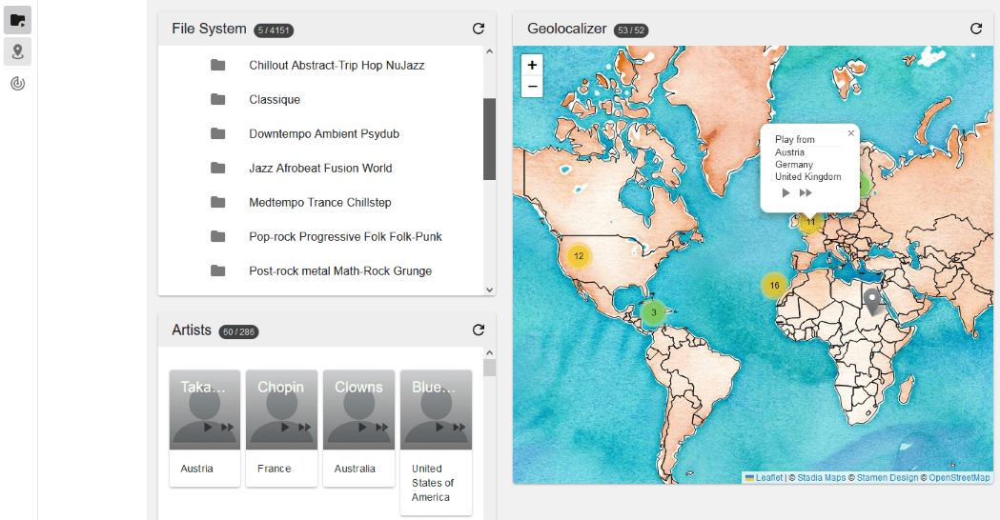
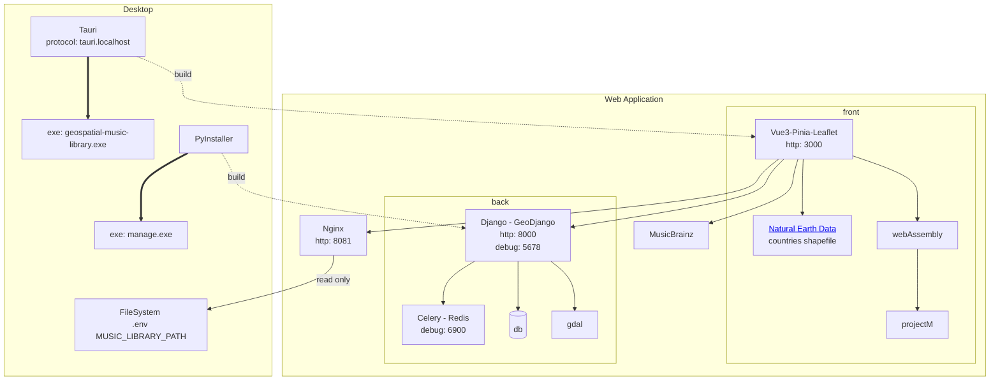
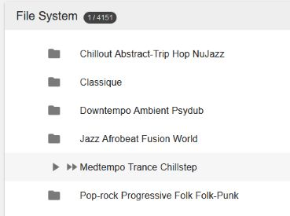
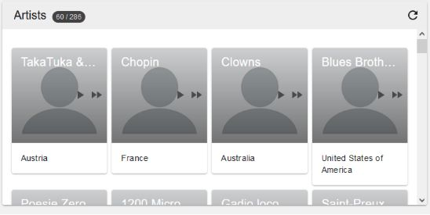
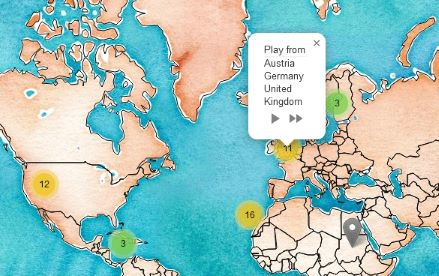
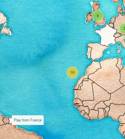
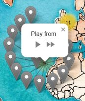
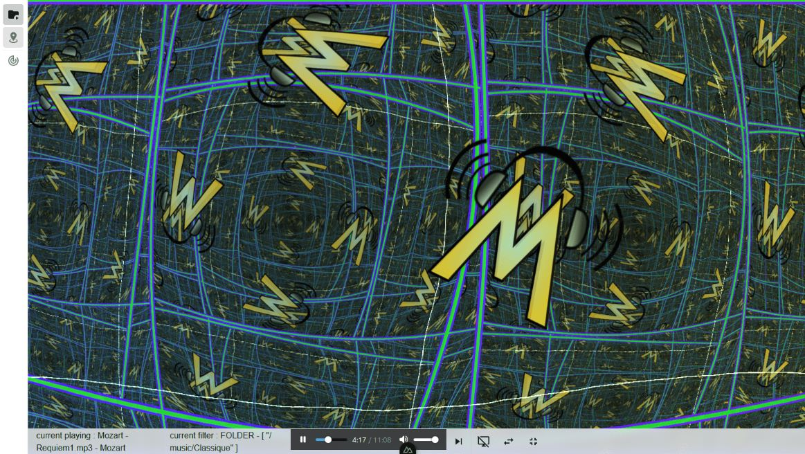
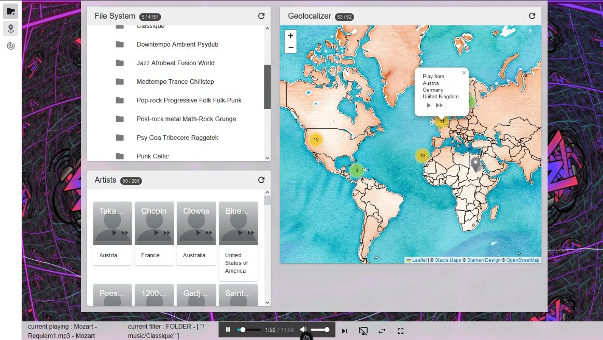

# Music Library player



Ever wanted to play your music located in France ? or Canada ? or Jamaiqua ?

Just pick a country and let the music play !

Known bug: Chrome doesn't display `<audio>` balise because of weird positioning, but the song is playing.

## What it is

- An Audio manager and player. Currently supporting MP3, OGG & WAV as I simply use <audio> html element. Sorry for all FLAC lovers.
- Define playlist from each available panels

- Music library accesses your local library in readonly mode
- Saves music and metadatas in database with the scan feature
  
## What it is not

- A music metadata editor. For that part, I recommend using [MP3Tag](https://www.mp3tag.de)

## Overview

Frontend : 
  - App : [Vue3](https://vuejs.org/), [Nuxt3](https://nuxt.com/), [Pinia](https://pinia.vuejs.org/)
  - Component Framework : [Vuetify3](https://vuetifyjs.com/)
  - Music Vizualiser : [projectM](https://github.com/projectM-visualizer/projectm) via [webAssembly](https://webassembly.org/)
  - Geospatial Map : [Leaflet](https://leafletjs.com/) with [Turf.js](https://turfjs.org/) and [shpjs](https://www.npmjs.com/package/shpjs)

Backend : 
  - Server : [python3](https://www.python.org/), [Django](https://www.djangoproject.com/), [Nginx](https://nginx.org/)
  - Database : [PostgreSQL](https://www.postgresql.org/), [PostGIS](https://postgis.net/)
  - Geospatial : [GeoDjango](https://docs.djangoproject.com/fr/5.0/ref/contrib/gis/)
  - Audio metadata : [mutagen](https://mutagen.readthedocs.io)
  - Distributed Task Queue : [Celery](https://docs.celeryq.dev) with [Redis](https://redis.io/fr/)

Release :
  - Frontend : [Tauri](https://tauri.app/)

## Architecture Diagram




## Features 

Play music and define next songs to play from :
 - Your filesystem 
   - 
 - Artists view
   - 
 - Country location
   - 

Add geolocalization to your artists, using 
  - [Musicbrainz](https://musicbrainz.org) API to get auto-suggestions
  - Manual picking for unknown artists or to fix out-of-boundaries locations


### Known limitation while auto-positioning
 ----
 - When using the geolocator, you may encounter weird positioning at first sight, as the points are calculated from the center of mass of the whole country.
i.e, for France, the auto-localizer always creates a point near Morocco in the ocean because this is the center of mass of France, French Guiana and Corsica. 

    - 

  - The result breaks the player toolbar :

    - 

You can use manual picking to rectify to the right location then.

----

Enjoy [ProjectM](https://github.com/projectM-visualizer/projectm)  vizualisations (PoC in very early stage)
  - Focus mode 

    - 

  - Background mode to keep editing the playlist

    - 


## Setup

Requires only [Docker](https://www.docker.com/) to launch application.

[NPM](https://www.npmjs.com/) if you want to build frontend as a desktop executable.


# Development

## Configuration

edit .env example before first launch :

 - `MUSIC_LIBRARY_PATH` : path to your music folder
 - `MUSIC_PATH_MAX_LENGTH` : default 500 character, increase that number if your music paths exceed this value, then restart backend.
 - `PG_DATA` : database persistency.
 - `API_HEADER_MAIL` : mandatory to use properly musicbrainz.org API

## Start up

full dockerized environment :
`docker compose --profile full up`

- frontend (`http://localhost:3000`)
- backend (`http://localhost:8000`)
  - Django admin (`localhost:8000/admin`)
    - root/root
- Nginx serving your music filesystem(`http://localhost:8081/music`)
- database access (`0.0.0.0:54333`)
  - postgres/postgres
  - database and schema : `music`.`public`
  - external database manager recommended [DBeaver](https://dbeaver.io/), for as long as I don't provide pgadmin container.

## FAQ

### Configuration update (.env)

You need to update your .env file configuration to add your email or link an other folder, don't forget to run the following command to apply changes:
 - `docker compose stop backend`
 - `docker compose up backend --build`

### "[backend] exec /app/run_dev.sh: no such file or directory"
This error may occur on backend start
 - run `dos2unix ./run_dev.sh` then `docker compose restart backend`

### Backend cannot connect to database
`backend` may fails to connect to database because it doesn't wait enough for the first db init :

 - Wait for the db container log line `LOG:  database system is ready to accept connections`. It may take a while and you may see database stopping and restarting in the process.
 - Then run `docker compose restart backend`.

### "[frontend] listen EADDRINUSE: address already in use"
Don't know why. may happen sometimes, we are not alone.
 - run `docker compose up frontend --force-recreate`

## Dev notes

Run frontend without server, use mocked data / API

```
  vite: {
    define: {
      VUE_APP_MOCK_SERVER: true
    },
```

## building production - PoC

### Windows 

WIP Does not contains postgres + gdal binaries, nginx not included either. Will not work without those binaries

 - configure `./services/backend/manage.spec` to includes new modules + third part binaries
 - compile executable `services/backend > docker run --volume "%cd%:/src/" batonogov/pyinstaller-windows:latest`
 - copy `./services/backend/dist/*.exe` in `./services/frontend/src-tauri/binaries`
 - rename the executable as `*-x86_64-pc-windows-msvc.exe`
 - then `services/frontend > npm run tauri build` 
 - executable will be in `services/frontend/src-tauri/target/release`. It works well with the backend launched in docker environment

# Thanks

 - ProjectM Webassembly integration :
   
   [evoyy:projectm-webgl-demo](https://github.com/evoyy/projectm-webgl-demo) for its ProjectM emscripten generation.
