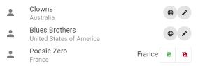

# Music Library player


Have you ever wonder of playing your music located in France ? or Canada ? or Jamaiqua ?

Just pick a country and let the music play !

(Also edit your music library to add geolocalisation link ;) )

## What it is

- An Audio manager and player. Currently supporting MP3, OGG & WAV as I simply use <audio> html element. Sorry for all FLAC lovers.
- Define playlist from each available panels

## What it is not

- A music metadata editor. For that part, I recommand using [MP3Tag](https://www.mp3tag.de)
  - Some functionalities adds metadata linked to your music, all saved in the embeded database. Your files are accessed on read-only.

## Overview

Frontend : 
  - App : [Vue3](https://vuejs.org/), [Nuxt3](https://nuxt.com/), [Pinia](https://pinia.vuejs.org/)
  - Component Framework : [Vuetify3](https://vuetifyjs.com/)
  - Music Vizualiser : [projectM](https://github.com/projectM-visualizer/projectm) via [webAssembly](https://webassembly.org/)
  - Geospatial Map : [Leaflet](https://leafletjs.com/) with [Turf.js](https://turfjs.org/) and [shpjs](https://www.npmjs.com/package/shpjs)

Backend : 
  - Server : [python3](https://www.python.org/), [Django](https://www.djangoproject.com/), [Nginx](https://nginx.org/)
  - Database : [PostgreSQL](https://www.postgresql.org/), [PostGIS](https://postgis.net/)
  - Geospatial : [GeoDjango](https://docs.djangoproject.com/fr/5.0/ref/contrib/gis/)
  - Audio metadata : [mutagen](https://mutagen.readthedocs.io)

Release :
  - Frontend : [Tauri](https://tauri.app/)

## Architecture Diagram

[WIP]

## Features 

- Music library accessing in readonly mode to your local library
  - Musics from your fileSystem are saved in the database on the first reach.
- Database persistency with metadata exposition

- Geospatial music filtering

  

- Geospatial music editor via [Musicbrainz](https://musicbrainz.org) API

  

- Geospatial music editor manual picking (either to fix ne_110m_admin_0_countries precision or when MusicBrainz doesn't know - which barely happens)

  

- ProjectM Milkdrop vizualisation in focus mode to enjoy animations (still WIP)

  

- ProjectM Milkdrop vizualisation in background mode to keep editing the playlist

  


A checksum is calculated based on music name, artist name and album name, to make the database resilient to filesystem changes.

## Setup

[Docker](https://www.docker.com/)

# Development

## Configuration

edit .env example before first launch :

 - `MUSIC_LIBRARY_PATH` : path to your music folder
 - `MUSIC_PATH_MAX_LENGTH` : default 500 character, increase that number if your music paths exceed this value, then restart backend.
 - `PG_DATA` : database persistency.
 - `API_HEADER_MAIL` : mandatory to use properly musicbrainz.org API

## Start up

`docker compose up`

- frontend (`http://localhost:3000`)
- backend (`http://localhost:8000`)
  - Django admin (`localhost:8000/admin`)
    - root/root
- Nginx serving your music filesystem(`http://localhost:8081/music`)
- database access (`0.0.0.0:54333`)
  - postgres/postgres
  - database and schema : `music`.`public`
  - external database manager recommended [DBeaver](https://dbeaver.io/), for as long as I don't provide pgadmin container.

### Notes

`backend` may fails to connect to database as it doesn't wait enough for the first db init :

 - Wait for the db container log line `LOG:  database system is ready to accept connections`. It may take a while and you may see database stopping and restarting in the process.
 - Then run `docker compose restart backend`.

## dev Notes

front end dev, set this variable to disable API calls if you do not plan to work with the server launched

```
  vite: {
    define: {
      VUE_APP_MOCK_SERVER: true
    },
```

## building production - PoC

### Windows 

WIP Does not contains postgres + gdal binaries, nginx not included either. Will not work without those binaries

 - configure `./services/backend/manage.spec` to includes new modules + third part binaries
 - compile executable `services/backend > docker run --volume "%cd%:/src/" batonogov/pyinstaller-windows:latest`
 - copy `./services/backend/dist/*.exe` in `./services/frontend/src-tauri/binaries`
 - rename the executable as `*-x86_64-pc-windows-msvc.exe`
 - then `services/frontend > npm run tauri build` 
 - executable will be in `services/frontend/src-tauri/target/release`. It works well with the backend launched in docker environment

# Thanks

 - ProjectM Webassembly integration :
   
   [evoyy:projectm-webgl-demo](https://github.com/evoyy/projectm-webgl-demo) for its ProjectM emscripten generation.
